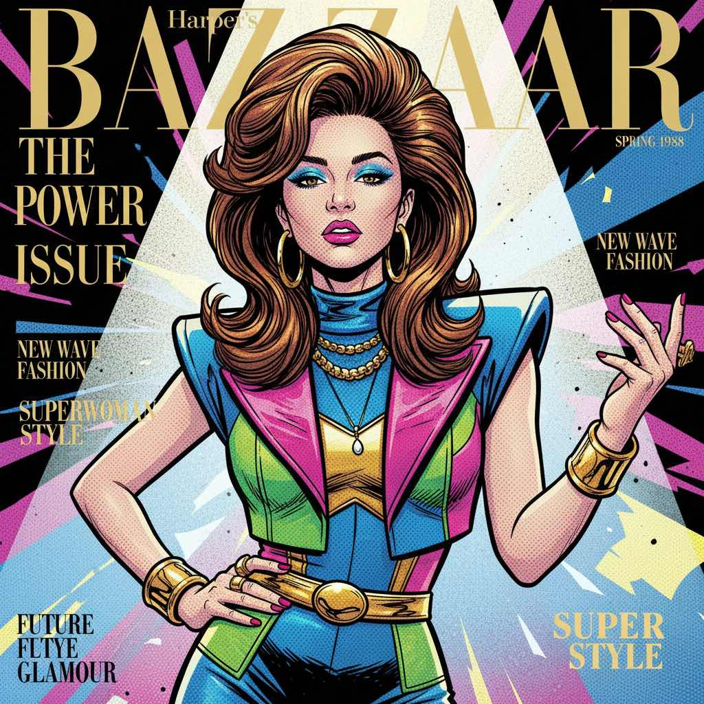
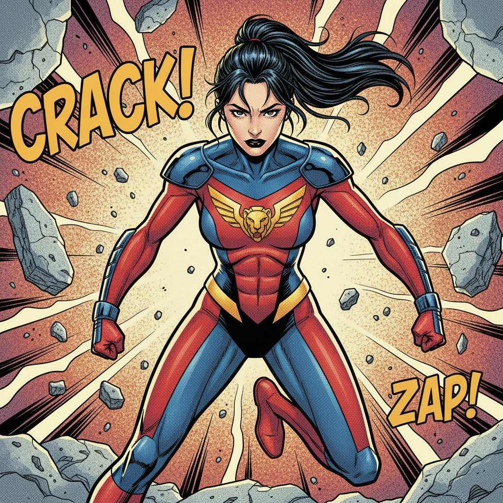

# Bazaar Retrospect

<div align="center">
  <h1>✨ Bazaar Retrospect ✨</h1>
  <p><strong>你的时尚时光机 — 将照片穿越到各个年代</strong></p>
  <p><strong>Your Fashion Time Machine — Transform photos into magazine covers across decades</strong></p>
</div>

---

## 效果展示

上传一张照片，选择年代，即可生成从 1920 年代到 2000 年代的时尚杂志封面：

| 1920s | 1930s | 1940s | 1950s | 1960s |
|:-----:|:-----:|:-----:|:-----:|:-----:|
|  |  |  |  |  |

| 1970s | 1980s | 1990s | 2000s |
|:-----:|:-----:|:-----:|:-----:|
|  |  |  |  |

---

## 功能特点

Bazaar Retrospect 是一款 AI 驱动的时尚杂志封面生成器，使用 Gemini AI 将你的照片变换成不同年代和风格的杂志封面。

### 核心功能

- ✅ **多杂志支持** - 9种杂志风格（Harper's Bazaar、Vogue、Elle、GQ、Vanity Fair、L'Officiel、Interview、i-D、W Magazine）
- ✅ **灵活年代选择** - 支持从 1920 年代到 2100 年代
- ✅ **随机模式** - 让命运来决定你的时尚之旅
- ✅ **预设主题** - 黄金时代、迪斯科、千禧一代、未来已来等
- ✅ **创意风格** - 20种艺术风格（赛博朋克、蒸汽波、新古典、文艺复兴、黑色电影等）
- ✅ **自定义提示词** - 用 {decade} 占位符描述你自己的风格
- ✅ **历史记录** - 保存和加载之前的结果
- ✅ **画廊视图** - 散落卡片或整齐网格布局
- 🖼️ 实时生成，支持双并发
- 💾 单张下载、ZIP批量下载、相册海报
- 📱 响应式设计，桌面端可拖拽
- 🔄 重新生成单张图片

### 创意风格示例

| 风格 | 描述 |
|------|------|
| 🎭 赛博朋克 | 霓虹灯、雨夜街道、高科技低生活 |
| 💗 蒸汽波 | 80年代怀旧、粉彩、希腊雕像 |
| 🏛️ 新古典 | 文艺复兴美学、油画质感 |
| 🎬 黑色电影 | 经典黑白、戏剧性阴影 |
| 🖌️ 水墨东方 | 传统东亚、水墨画 |
| 🌃 故障艺术 | 数字腐蚀、RGB错位效果 |

### 杂志风格

| 杂志 | 风格特点 |
|------|---------|
| Harper's Bazaar | 经典优雅、博物馆级品质 |
| Vogue | 高端时尚、超模美学 |
| Elle | 青春活力、巴黎 chic |
| GQ | 男性优雅、都市专业 |
| Vanity Fair | 旧日魅力、好莱坞黄金时代 |
| L'Officiel | 前卫先锋、实验性 |
| Interview | 安迪·沃霍尔、波普艺术 |
| i-D | 街头文化、纪实风格 |
| W Magazine | 当代艺术、概念性 |

---

## 快速开始

### 环境要求

- Node.js 18+
- Gemini API Key（从 [Google AI Studio](https://aistudio.google.com/app/apikey) 获取）

### 安装步骤

1. **克隆或下载项目**
   ```bash
   cd Bazaar-Retrospect
   ```

2. **安装依赖**
   ```bash
   npm install
   ```

3. **配置 API Key（两种方式）**

   **方式一：使用应用内弹窗（推荐快速配置）**
   - 运行 `npm run dev`
   - 首次访问时会自动弹出 API Key 配置窗口
   - 或随时点击左上角 ⚙️ 设置图标

   **方式二：使用 .env 文件（推荐永久配置）**
   ```bash
   cp .env.example .env
   ```
   编辑 `.env` 文件，添加你的 Gemini API Key：
   ```
   GEMINI_API_KEY=your_actual_api_key_here
   ```

4. **启动开发服务器**
   ```bash
   npm run dev
   ```

5. **打开浏览器**
   访问 http://localhost:3000

---

## 使用指南

### 基本流程

1. **上传照片**
   - 点击首页的杂志封面
   - 选择一张清晰的正面肖像照片

2. **选择杂志**
   - 选择 1-3 种杂志风格
   - 每种杂志都有独特的排版和配色

3. **选择年代**
   - **自定义模式**：点击选择具体年代
   - **随机模式**：点击 "惊喜模式！" 随机选择
   - **预设模式**：选择主题预设如"黄金时代"或"未来已来"

4. **高级选项（可选）**
   - **创意风格**：添加赛博朋克、蒸汽波等艺术效果
   - **自定义提示词**：用 {decade} 占位符写你自己的描述

5. **生成封面**
   - 点击 "Generate"
   - 查看实时进度指示器
   - 等待 AI 生成所有封面

6. **查看结果**
   - **散落视图**：可拖拽的散落卡片
   - **画廊视图**：整齐的网格布局

7. **下载**
   - **Download All (ZIP)**：所有封面打包成 ZIP
   - **Download Album**：所有封面合成为一张海报
   - **单独下载**：鼠标悬停点击下载按钮

8. **保存历史**
   - 点击 "Save to History"
   - 点击右上角时钟图标查看历史记录

9. **重新生成**
   - 鼠标悬停在任何封面上，点击刷新按钮重新生成

---

## 项目结构

```
Bazaar-Retrospect/
├── components/
│   ├── MagazineCover.tsx          # 杂志封面组件（多风格支持）
│   ├── PolaroidCard.tsx           # 宝丽来卡片
│   ├── DecadeSelector.tsx         # 年代选择器（自定义/随机/预设）
│   ├── MagazineSelector.tsx       # 杂志选择器
│   ├── CreativeStyleSelector.tsx # 创意风格选择器
│   ├── ViewToggle.tsx             # 视图切换
│   ├── CustomPromptEditor.tsx    # 自定义提示词编辑器
│   ├── HistoryPanel.tsx           # 历史记录面板
│   ├── ApiKeyModal.tsx            # API Key 配置弹窗
│   ├── Footer.tsx                 # 页脚
│   └── ui/
│       └── draggable-card.tsx     # 可拖拽卡片
├── src/
│   └── config/
│       ├── magazines.ts           # 杂志配置
│       ├── eras.ts                # 年代配置（1920s-2100s）
│       ├── creativeStyles.ts       # 创意风格配置（20种风格）
│       └── presets.ts             # 预设主题配置
├── services/
│   └── geminiService.ts           # Gemini API 服务
├── lib/
│   ├── albumUtils.ts              # 相册生成
│   ├── historyUtils.ts            # 历史记录工具
│   └── utils.ts                   # 通用工具
├── App.tsx                        # 主应用组件
├── index.tsx                      # 入口文件
├── vite.config.ts                 # Vite 配置
├── tsconfig.json                  # TypeScript 配置
├── .env.example                   # 环境变量模板
└── package.json
```

---

## 可用命令

| 命令 | 描述 |
|------|------|
| `npm run dev` | 启动开发服务器（端口 3000） |
| `npm run build` | 构建生产版本 |
| `npm run preview` | 预览生产版本 |

---

## 环境变量

| 变量 | 必填 | 描述 |
|------|------|------|
| `GEMINI_API_KEY` | 是 | Gemini API 密钥 |

---

## 技术栈

- **React 19** - UI 框架
- **TypeScript** - 类型安全
- **Vite** - 构建工具
- **Framer Motion** - 动画效果
- **Gemini API** - AI 图像生成
- **JSZip** - ZIP 文件生成
- **LocalStorage** - 历史记录存储

---

## 注意事项

1. **API Key 安全**：不要将 `.env` 提交到 Git
2. **照片质量**：清晰的正面肖像效果最佳
3. **生成时间**：首次生成可能需要较长时间，请耐心等待
4. **配额限制**：注意监控你的 Gemini API 配额使用情况
5. **历史记录**：存储在浏览器 LocalStorage 中，清除浏览器数据会丢失历史

---

## 路线图

未来可能添加的功能：

- [ ] 直接分享到社交媒体
- [ ] 水印选项
- [ ] 导出为 PDF
- [ ] 批量重新生成失败的封面
- [ ] 提示词模板库
- [ ] 多人模式（合照）
- [ ] 电影海报风格
- [ ] 职业转换模式

---

## 许可证

Apache-2.0
